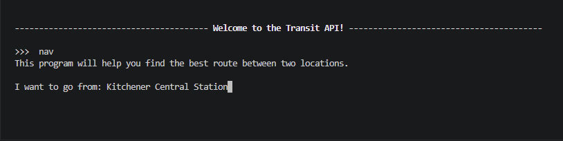
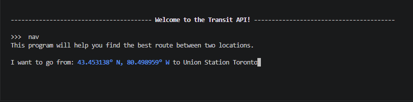
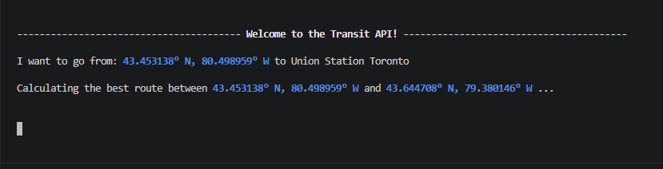
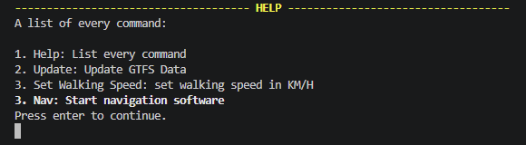

# Python-Transit-App

and future API.

## About

This is a simple text based navigation software, loaded with files from Southern Ontario's GRT, GO and TTC transit agencies.

It will find you the best route from point A to B, via up to one leg being taken by transit. There are features in the works to permit more transit transfers, but as of now they are far too slow to be production ready.

You can customize the walking speed through the command prompt, and other the agencies can be customized in `src/gtfs.py`. (Lines 23 through 30)

## Running

If you are ok with the defaults, running this project is really quite simple! On Windows, its as simple as downloading the file and running it!

Here's a sample run.

Firstly, once the files have been downloaded, you will be presented with the console.

From there, you may enter a command. I encourage you to try it yourself, but if you'd rather read, so be it.

---

From there, to start navigation, you may enter `nav` (not case sensitive).

Press enter.

It will now prompt you to input a starting location. Do that. Here, we will start from Kitchener Central Station.

Pressing enter will convert the address to coordinates. You could have also inputed coordinates.

From there, repeate the same steps for the second location. (In this case Union Station Toronto)

From there, you will now see the entire route!

You can press enter to restart.

---

There are also other commands you can use, and to get them run `help`.

---

Please note that on your first run it will download GTFS data for all agencies in `src/gtfs.py`, which may take a while. On every run in the beginning it will read the cache, which is faster, but with multiple agencies may take quite a while.

### Dev Run

Quite simple actually, just run:\
`git clone https://github.com/roc-ket-cod-er/Python-Transit-API`
`cd Python-Transit-API/src`

install dependancies:\
`pip install geopy urllib3 aioconsole aiohttp orjson`

run file:
`python main.py`

## Development

This has been quite a long project, as all this stuff has been new to me and is just such a difficult thing to have a bunch of different protocols all stuffed into your brain, and all swiriling togeather and you being unsure whatever you need to do.

---

It all colapsed when I tryed to add transfers, as in this blistering heat my computer would rev for a straight minute to route it, which I know for a fact is not good. At one point my scrip was kind of able to find transfers, but it wasn't quite useful yet, and the functions are still there in case you want to try implementing it yourself. (I encourage you to! I may eventually get around to implementing it.)

---

Another thing to note is that this script absolutely ***eats*** ram. I recorded it running well over 5GB. This is due to how big the files are. Just one of TTC's files is over *4.5 **million** rows* long.

---

I've always wanted to develop a router, and this will (at some point) actually work and be implemented for in my upcomming hardware project CWatch, and my current [Cpeedo](https://github.com/roc-ket-cod-er/Cpeedo-mk5).